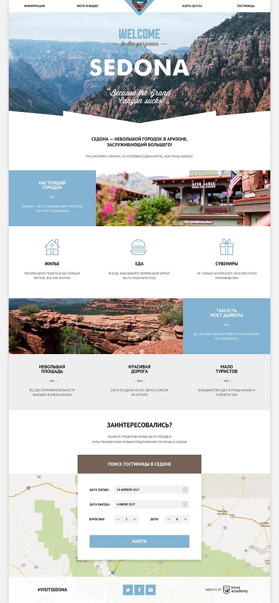
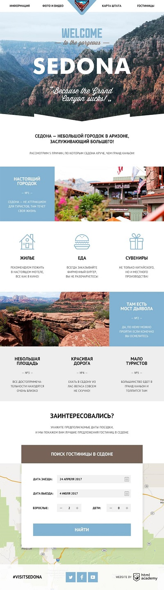
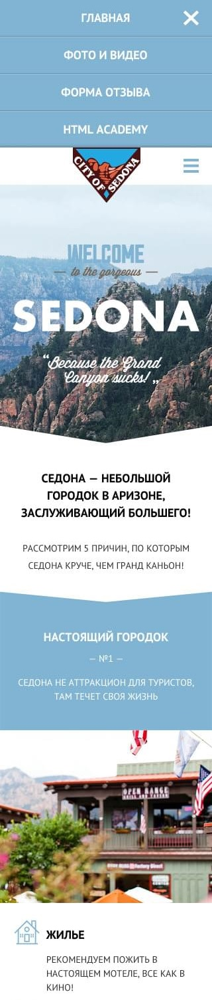
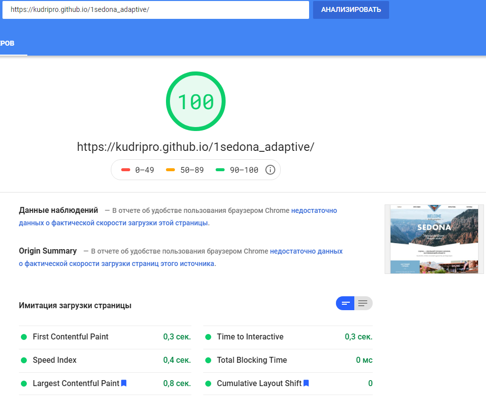
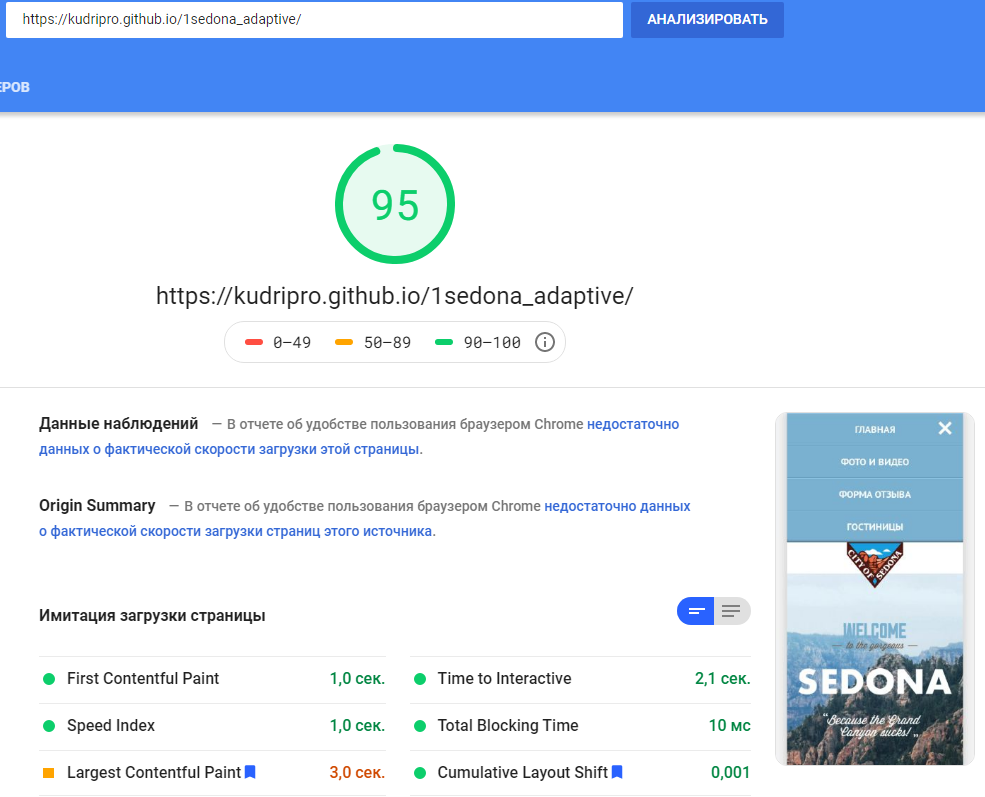

# Проект «Седона»

* Вёрстка: [Алёна Стасенко](https://github.com/KudriPro).
* Макет: [HTML Academy](https://htmlacademy.ru).

## Описание
Учебный проект «Седона» был выполнен в рамках пройденного онлайн‑курса «Продвинутый HTML и CSS» от HTML Academy.

* Используемые технологии: _HTML, CSS, БЭМ, JS, Адаптивный дизайн_.
* Автоматизация: _Gulp_.
* Фреймворки: _нет_
* Препроцессоры: _LESS_
* JS модули: _[всплывающие окна, сортировка отелей]_.

## Ссылки 
<table>
  <tr>
  <th><a href="https://kudripro.github.io/device_adaptive/">Главная страница 1200px</a></th>
  <th><a href="https://kudripro.github.io/device_adaptive/">Главная страница 768px</a></th>
  <th><a href="https://kudripro.github.io/device_adaptive/">Главная страница 320px</a></th>
  </tr>
  <tr valign="top">
    <td>
      
    </td>
    <td>
          
    </td>
    <td>
          
    </td>
  </tr>
</table>

## PageSpeed Insights
<table>
  <tr>
    <th>Для компьютеров</th>
    <th>Для мобильных</th>
  </tr>
  <tr valign="top">
    <td>
        
    </td>
    <td>
         
    </td>
  </tr>
</table>
